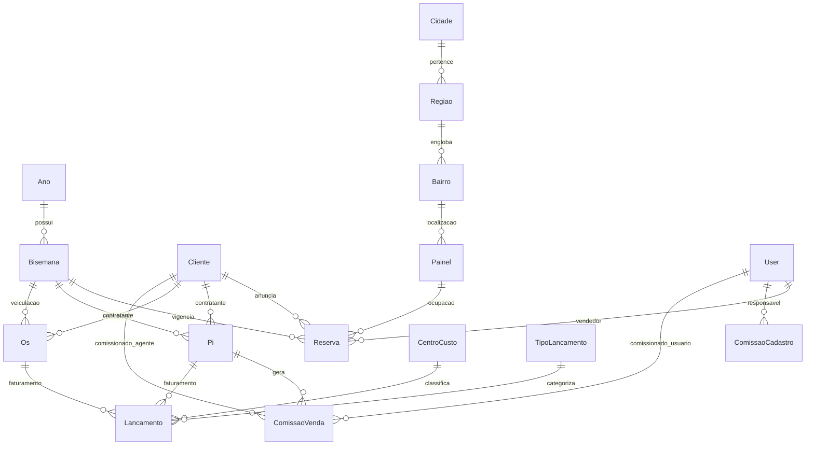

# Documentação do Sistema SGEP (Sistema de Gestão de Empresas de Propaganda / OOH)

> **Versão do Sistema:** SGEP 2.0  
> **Framework:** Laravel 10 (PHP 8.1+)  
> **Frontend:** Arquitetura Híbrida com Inertia.js (Vue 3 + React 18) & Tailwind CSS  
> **Banco de Dados:** MySQL / MariaDB  

---

## 1. Visão Geral

O **SGEP (Sistema de Gestão de Empresas de Propaganda)** é uma aplicação voltada para a gestão comercial, operacional e financeira de empresas exibidoras de mídia exterior (**Out-of-Home / OOH**).

O sistema gerencia todo o ciclo de vida da publicidade exterior, incluindo:
1. **Outdoors Convencionais e Frontlights:** Comercializados no modelo tradicional brasileiro de **Bi-semanas** (períodos padronizados de 14 dias ao longo do ano).
2. **Painéis Digitais de LED:** Mídia digital com contratos contínuos ou por período flexível, exigindo controle de conflitos de anunciantes e alertas de expiração.
3. **Operação e Colagem:** Emissão de roteiros e relatórios de colagem para equipes de campo.
4. **Comercial e Vendas:** Emissão de **Pedidos de Inserção (PI)**, **Ordens de Serviço (OS)**, contratos e propostas com vias do cliente e do financeiro.
5. **Financeiro e Caixa:** Controle de contas a receber derivadas de PIs e OSs, parcelamento, centros de custo, tipos de lançamentos e fluxo de caixa.
6. **Comissionamento:** Apuração automática de comissões para vendedores internos e agências de publicidade (agentes parceiros) com regras percentuais ou valores fixos.

---

## 2. Arquitetura e Stack Tecnológica

### Backend
- **Laravel 10.x** sob **PHP 8.1+**
- **Autenticação:** Laravel Breeze com controle de perfis e permissões via `spatie/laravel-permission`.
- **Geração de Documentos / PDFs:** `barryvdh/laravel-dompdf`, `spatie/browsershot` e `spatie/laravel-pdf` para geração automatizada de PIs, contratos e relatórios paisagem/retrato.
- **Processamento de Imagens / CLI:** Comando Artisan `painel:refresh-compressed` para otimização e compressão de fotos dos outdoors mantidas no disco de storage (`storage/app/public/outdoorImages`).
- **Banco de Dados Relacional:** MySQL / MariaDB com Stored Procedures (`CALL InsereBisemanas(ano)`) para geração e sincronização automática das datas de bi-semanas para novos anos civis.

### Frontend
A aplicação conta com uma camada de visualização unificada via **Inertia.js**, dividida estrategicamente em:
- **Módulos em Vue 3 (`resources/js/Pages`):**
  - Cadastros base (Painéis, Clientes, Bairros, Regiões, Cidades, Configurações, Roles).
  - Telas legadas de relatórios, lançador de vendas e reserva visual de painéis.
  - Componentes com FormKit, Headless UI, CKEditor e FontAwesome.
- **Módulos Modernizados em React 18 (`resources/js/react`):**
  - Root view dedicada: `resources/views/app-react.blade.php`.
  - **Novo Dashboard Executivo:** Gráficos analíticos com Chart.js, taxa de ocupação em tempo real, status de veiculação e rankings de clientes e vendedores.
  - **Controle de Caixa & Lançamentos:** Interface reativa para acompanhamento de parcelas, status de pagamento (Quitado/Pendente) e detalhes de liquidação.
  - **Módulo de Reservas Sem PI:** Interface em lote para converter reservas abertas em PIs com cálculo automatizado de comissões e integração financeira.
  - **Cadastro Unificado de Comissões:** Gerenciamento de tabelas de comissão por porcentagem ou valor fixo associadas a pessoas ou usuários.
  - Componentes estilizados com Tailwind CSS, Radix UI e Lucide Icons.

---

## 3. Principais Modelos de Dados e Entidades



### 3.1. Calendário e Bi-semanas
- **`Ano` (`app/Models/Config/Ano.php`):** Registra o ano de operação (ex: 2024, 2025, 2026).
- **`Bisemana` (`app/Models/Bisemanas/Bisemana.php`):** Representa o ciclo de 14 dias da publicidade exterior (número da BS, data inicial, data final e ano de referência).

### 3.2. Painéis e Geografia
- **`Painel` (`app/Models/Paineis/Painel.php` / tabela `outdoors`):** Cadastro do ponto de veiculação:
  - `identificacao` (número/código da placa) e `ident_antiga`.
  - `is_led` (0 = outdoor/frontlight convencional; 1 = painel de LED digital).
  - Localização: `logradouro`, `numero`, `bairro_id`, `ponto_referencia`, `latitude`, `longitude`.
  - Aspectos técnicos e regulatórios: `cadan` (cadastro municipal), `posicao`, `dimensao`, `dimensao_lona`.
  - `image_url` e histórico de fotos otimizadas.
- **Hierarquia Geográfica:** `Cidade` $\rightarrow$ `Regiao` $\rightarrow$ `Bairro`.

### 3.3. Clientes e Parceiros
- **`Cliente` (`app/Models/Clientes/Cliente.php`):**
  - Cadastro de anunciantes com Razão Social, Nome Fantasia, CPF/CNPJ, Inscrição Municipal, Contatos e Endereço.
  - Flag `agent`: Identifica se o cadastro atua como agência de publicidade / intermediador de mídia que recebe comissões.

### 3.4. Reservas e Operação Comercial
- **`Reserva` (`app/Models/Reservas/Reserva.php`):**
  - Associação entre `outdoor_id`, `cliente_id`, `bisemana_id` e `user_id` (vendedor).
  - Campos de controle: `campanha`, `observacao`, `dt_reserva`, `pi_id` e `pi_ok` (indica se já foi faturada via PI).
- **`Pi` (`app/Models/PI/Pi.php`):**
  - **Pedido de Inserção:** Documento legal que formaliza o aluguel dos espaços.
  - Dados: cliente, painéis vinculados (JSON), bi-semana, vendedor, campanha, valores (`vl_unit`, `vl_desc`, `vl_custo`, `vl_total`), prazos e forma de pagamento (`pago`, `dt_pgto`, `forma_pagamento`).
  - Geração de arquivos PDF assináveis para o cliente e para o arquivo interno.
- **`Os` (`app/Models/Vendas/Os.php`):**
  - **Ordem de Serviço:** Comercialização de serviços avulsos de mídia, produção, lona ou impressão não restritos a reservas de placas padrão.

### 3.5. Financeiro e Fluxo de Caixa
- **`Lancamento` (`app/Models/Financeiro/Lancamento.php`):**
  - Contas a pagar/receber no caixa.
  - Vinculado a `CentroCusto` e `TipoLancamento`.
  - Rastreabilidade via `id_reserva` (ID do PI ou OS associado).
  - Gestão de parcelas (`1/3`, `2/3`, etc.), `dt_faturamento`, `status_pagamento` (ex: `QUITADO` ou `PENDENTE`) e `dt_pagamento_real`.
- **`CentroCusto` & `TipoLancamento`:** Estruturação contábil e orçamentária da empresa.

### 3.6. Motor de Comissões
- **`ComissaoCadastro` (`app/Models/Financeiro/ComissaoCadastro.php`):** Tabela mestre de regras de comissão (percentual ou fixa, aplicável a vendedor ou agente parceiro).
- **`ComissaoVenda` (`app/Models/Financeiro/ComissaoVenda.php`):** Registro individual da comissão gerada em uma PI específica, calculando o valor monetário devido ao beneficiário (`user` ou `agente`).

### 3.7. Governança e Textos Padrão
- **`TextoPadrao` & `TipoTexto` (`app/Models/Textos/`):** Cláusulas contratuais, termos de aceite e declarações legais pré-formatadas para inclusão automática nos rodapés e anexos das PIs em PDF.
- **`Roles` & `Permissions`:** Matriz de autorização baseada em cargos (Administrador, Comercial, Operacional, etc.).

---

## 4. Módulos do Sistema e Funcionalidades

### 4.1. Dashboard Executivo Inteligente (`/dashboard`)
Construído em React com Inertia:
- **Filtros Temporais Reativos:** Seleção por Ano e por Bi-semana ativa (identificando a BS em vigência hoje automaticamente).
- **KPIs em Tempo Real:**
  - Total de painéis ativos, subdivididos em convencionais e digitais (LED).
  - Clientes com reservas no período selecionado e novos clientes cadastrados no mês.
  - Total de PIs emitidos e faturamento bruto total do período.
  - Total de comissões geradas vs. comissões já quitadas (com base no pagamento da PI).
  - Alerta de contratos de LED com vencimento próximo (janela de 5 dias).
- **Indicadores Gráficos:**
  - Barra de status da Bi-semana: Status de veiculação (Ativa, Aguardando Início ou Finalizada), taxa de ocupação percentual de faces e faturamento total.
  - Gráfico de Vendas por Vendedor (Top 3 + Demais agrupados).
  - Gráfico de Reservas por Cliente (Top 4 + Demais agrupados).
- **Listas Rápidas:** Últimas 10 reservas cadastradas e próximos 10 PIs com status financeiro integrado.

### 4.2. Gestão de Painéis e Mídia Exterior (`/Paineis`, `/CadPainel`)
- Cadastro completo das placas exibidoras com coordenadas geográficas para roteirização e mapas.
- Indicação do número CADAN (regularidade perante posturas municipais).
- Classificação tecnológica: Outdoor Convencional / Frontlight ou Painel de LED Digital.
- Upload de imagens e pipeline automatizado de compressão (`painel:refresh-compressed`) garantindo performance na montagem de propostas comerciais.

### 4.3. Reserva de Painéis e Disponibilidade (`/ResPaineis`, `/ResPaineisCli`)
- **Consulta de Disponibilidade:** Busca por bi-semana, cidade, região, bairro e tipo de painel (LED ou Convencional). Exibe quais placas estão livres e quais estão ocupadas.
- **Reserva Direta:** Bloqueio do painel para um cliente com definição da campanha, vendedor e observações.
- **Reserva Extensiva para Clientes:** Permite reservar um lote de painéis para múltiplos períodos de bi-semanas contínuas em uma única transação, com prevenção automática de conflito de datas.

### 4.4. Módulo de Reservas Sem PI (`/reservas-sem-pi`)
- Tela focada na produtividade da equipe comercial.
- Lista reservas confirmadas que ainda não tiveram o contrato/PI gerado.
- Agrupamento de reservas por cliente e bi-semana.
- Ação de **Gerar PI por Reserva**:
  - Configuração de valores (valor unitário, descontos, valor líquido).
  - Associação de agentes/agências comissionadas.
  - Configuração do parcelamento (datas de vencimento e valores por parcela).
  - Inserção automática dos lançamentos no fluxo de caixa.
  - Renderização instantânea do PDF do contrato para impressão ou envio digital.

### 4.5. Painéis de LED Digital (`/MapaOcupacaoLed`, `/RelReservasLed`)
Diferente dos outdoors estáticos de 14 dias, o módulo de LED opera com serviços inteligentes via `LedService`:
- **Mapa de Ocupação Contínuo:** Matriz visual de exibição de campanhas por período.
- **Prevenção de Conflitos (`verificaConflitoLed`):** Impede a sobreposição indevida de clientes no mesmo display digital durante a mesma vigência.
- **Alertas de Término de Contrato:** Identificação dinâmica de contratos vencendo hoje ou nos próximos 5 dias úteis.
- **Extensão Rápida de Contrato (`extenderReservaLed`):** Prorrogação ágil do contrato do cliente para as bi-semanas subsequentes sem necessidade de recadastramento.

### 4.6. Módulo Comercial de Vendas e Ordens de Serviço (`/Vendas/Lancar`, `/VendasGeradas`)
- Lançamento de serviços de comunicação visual, impressão de lonas, produção de cartazes ou vendas avulsas de mídia.
- Gera número sequencial de OS (Ordem de Serviço), gera contrato formal em PDF e registra os vencimentos no módulo financeiro.

### 4.7. Gestão Financeira e Controle de Caixa (`/caixa`, `/Caixa`)
- Interface de fluxo de caixa com filtros por:
  - Status de pagamento (`QUITADO` / `PENDENTE`).
  - Centro de custo e tipo de lançamento.
  - Busca textual em descrições, observações e números de PI/OS.
- Visão de totais consolidados: Total Geral, Total Quitado e Saldo Pendente.
- Detalhamento de comissões provisionadas vinculadas a cada lançamento comercial.
- Ações rápidas de alteração de status de pagamento com registro da data real de quitação (`dt_pagamento_real`).

### 4.8. Cadastro e Regras de Comissões (`/cadastro-comissoes`)
- Definição flexível de políticas de incentivo e comissionamento:
  - Tipo percentual (%) sobre o valor líquido faturado.
  - Tipo fixo (R$) por serviço ou face comercializada.
- Atribuição a vendedores (usuários do sistema) ou a agências terceirizadas (clientes marcados como agentes).
- Ativação/inativação de regras com auditoria de datas de atualização.

### 4.9. Central de Relatórios e Inteligência Operacional
O sistema possui 8 controladores dedicados de relatórios com emissão em PDF e visualização em grade:
1. **Relatório de Colagem (`/RelColagem`):** Roteiro operacional para os coladores de cartaz, ordenado por cidade, região e bairro, com especificações da campanha.
2. **Relatório de Ocupação (`/RelOcupacao`):** Taxa percentual de aproveitamento do inventário de placas por bi-semana.
3. **Painéis x Bi-semanas (`/RelPainelBisemana`):** Matriz anual completa exibindo a situação de cada placa ao longo de todas as 26 ou 27 bi-semanas do ano.
4. **Painéis x Clientes (`/PaineisCliente`):** Relação de locais contratados por anunciante em determinada bi-semana.
5. **Relatório de Reservas por Cliente (`/ReservaCliente`):** Histórico de contratações de um cliente específico.
6. **Relatório de Lançamentos Financeiros (`/RelLancamentos`):** Demonstrativo de contas a receber e pagar por período e centro de custos.
7. **Relatório de Comissões (`/RelComissoes`):** Extrato analítico de comissões devidas e pagas para cada colaborador e agência.
8. **Relatórios de LED (`/RelReservasLedPdf`):** Ocupação e vigência detalhada das telas digitais em PDF.

### 4.10. Governança e Configurações (`/configuracoes`)
- **Geração de Novo Ano de Bi-semanas:** Criação do calendário anual com cálculo das datas oficiais de início e término via stored procedure.
- **Gestão de Acessos (ACL):** Manutenção de papéis e atribuição de permissões granulares com Spatie Laravel Permission.
- **Textos Padrão:** Editor de minutas contratuais e termos jurídicos integrados com CKEditor/Tiptap.
- **Otimização de Imagens:** Gatilho para processar e comprimir imagens de todo o catálogo de painéis para reduzir tráfego e consumo de memória.

---

## 5. Mapeamento de Diretórios

```
sgepNovo/
├── app/
│   ├── Console/Commands/        # Comandos Artisan (RefreshCompressedImages)
│   ├── Helpers/                 # helpers.php (formatadores de moeda, doc, hidratação de comissão)
│   ├── Http/Controllers/
│   │   ├── Api/                 # Endpoints REST auxiliares
│   │   ├── Arquivos/            # Gestão e download de PIs e OSs geradas
│   │   ├── Auth/                # Autenticação e redefinição de senhas
│   │   ├── Clientes/            # CRUD de clientes e agentes
│   │   ├── Config/              # Anos, Usuários, Perfis (Roles) e Textos Padrão
│   │   ├── Enderecos/           # Bairros, Regiões, Cidades e UFs
│   │   ├── Financeiro/          # Caixa, Lançamentos, Centros de Custo e Serviços
│   │   ├── Paineis/             # Cadastro e manutenção dos pontos de mídia
│   │   ├── Relatorios/          # 8 controladores de relatórios (Colagem, Ocupação, LED, etc.)
│   │   ├── Reserva/             # Reservas de placas, emissão de PIs e regras de LED
│   │   ├── Vendas/              # Lançamento e controle de Ordens de Serviço (OS)
│   │   ├── ReactDashboardController.php       # Controller do novo Dashboard
│   │   ├── ReactCaixaController.php           # Controller do novo Caixa reativo
│   │   ├── ReactReservasSemPIController.php   # Controller da geração de PI em lote
│   │   └── ReactComissoesController.php       # Controller de comissões unificadas
│   ├── Models/
│   │   ├── Bisemanas/           # Bisemana.php
│   │   ├── Clientes/            # Cliente.php
│   │   ├── Config/              # Ano, Roles, Permissions, Whatsapp
│   │   ├── Enderecos/           # Bairro, Cidade, Regiao, UF
│   │   ├── Financeiro/          # Lancamento, CentroCusto, TipoLancamento, Comissao...
│   │   ├── Paineis/             # Painel.php (outdoors)
│   │   ├── PI/                  # Pi.php
│   │   ├── Reservas/            # Reserva.php
│   │   ├── Textos/              # TextoPadrao.php, TipoTexto.php
│   │   └── Vendas/              # Os.php
│   └── Services/                # Camada de serviços de domínio
│       ├── ClienteService.php
│       ├── PainelService.php
│       ├── Financeiro/CaixaService.php
│       ├── Pi/PiService.php
│       ├── Reserva/LedService.php
│       └── Texto/TextoService.php
├── database/
│   ├── migrations/              # Histórico e evolução do schema (LED, comissões, OS, etc.)
│   └── seeders/
├── resources/
│   ├── js/
│   │   ├── Pages/               # Telas em Vue 3 (Cadastros, Configurações, Relatórios)
│   │   ├── react/               # Telas e componentes em React 18 (Dashboard, Caixa, Sem PI, Comissões)
│   │   ├── app.js               # Entrada Inertia Vue
│   │   └── app-react.jsx        # Entrada Inertia React
│   └── views/
│       ├── app.blade.php        # Layout base Vue
│       ├── app-react.blade.php  # Layout base React
│       └── relatorios/          # Templates Blade para exportação em PDF (DomPDF)
└── routes/
    ├── web.php                  # Rotas completas da aplicação web
    ├── api.php                  # Rotas de integração / APIs
    └── auth.php                 # Rotas de autenticação
```

---

## 6. Fluxos de Trabalho Típicos do Negócio

### Fluxo A: Venda de Outdoor Convencional
1. **Consulta e Reserva:** O vendedor acessa a tela de disponibilidade (`/ResPaineis`), filtra a bi-semana e localização desejada, e reserva as faces para o anunciante.
2. **Formalização em PI:** No módulo `/reservas-sem-pi`, o operador seleciona as reservas aprovadas, define os valores unitários, eventuais descontos e as condições de pagamento (à vista ou parcelado).
3. **Geração Contratual:** O sistema gera o registro do **PI** (`pi`), atualiza o status das reservas (`pi_ok = 1`) e emite duas vias em PDF (Via do Cliente e Via do Financeiro com instruções de faturamento).
4. **Alimentação do Caixa:** Os vencimentos das parcelas são inseridos automaticamente na tabela de lançamentos financeiros (`lancamentos`).
5. **Apuração de Comissão:** São gravados os registros de comissão devida ao vendedor e/ou agência (`comissao_venda`).
6. **Operação:** A equipe de produção e colagem emite o **Relatório de Colagem** (`/RelColagem`) para colar os cartazes de papel ou lonas nos pontos físicos.

### Fluxo B: Contrato de Painel de LED Digital
1. **Verificação de Conflitos:** Através de `/MapaOcupacaoLed`, o sistema valida se as bi-semanas solicitadas estão livres para aquele display digital.
2. **Reserva e Alerta:** A veiculação é agendada e monitorada pelo `LedService`.
3. **Acompanhamento no Dashboard:** Quando o contrato atinge os últimos 5 dias de vigência, o painel exibe destaque em amarelo na tela inicial.
4. **Renovação:** A qualquer momento, o operador pode clicar em **Extender Reserva** e adicionar novos períodos para o cliente de forma contínua.

### Fluxo C: Quitação e Pagamento de Comissões
1. **Recebimento:** No módulo `/caixa`, o financeiro confere o recebimento da parcela do anunciante e marca o lançamento como `QUITADO`, informando a data real do pagamento.
2. **Liberação da Comissão:** Ao quitar o recebimento associado ao PI, a comissão correspondente do vendedor ou agente parceiro é classificada como apta para pagamento no relatório de comissões e no indicador do Dashboard.
